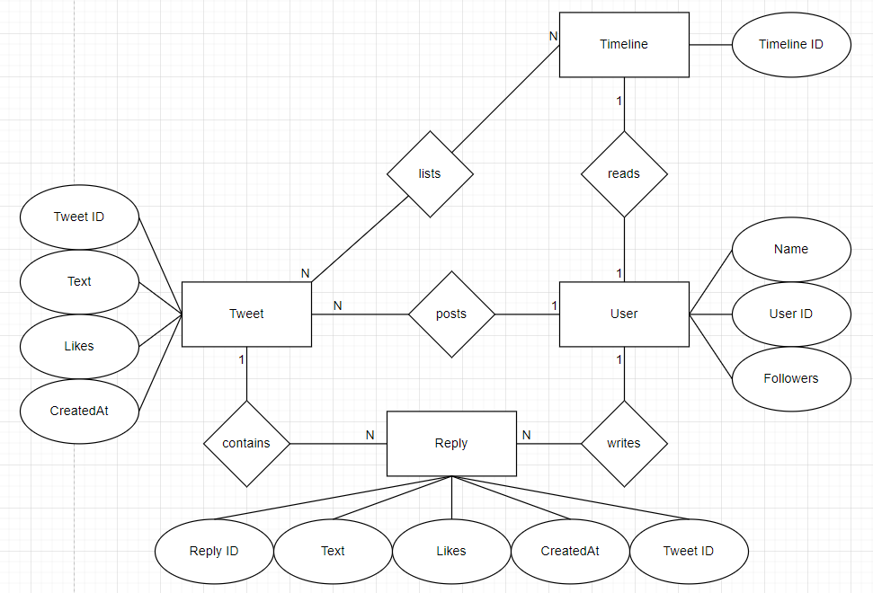

# Y

# DynamoDB Report

Datenbanken 2 (262180)

Christian Diegmann | 208822 | 7. Semester

Martin Marsal | 209390 | 7. Semester

Robin Schüle | 208957 | 7. Semester

Repository: https://git.it.hs-heilbronn.de/it/courses/seb/db2/ws23/y

# Einführung

## Why Y?
Y ist eine Social-Media-Plattform ähnlich zu Twitter, die es Nutzern ermöglicht, kurze Textnachrichten, sogenannte "Tweets", zu verfassen und zu veröffentlichen.
Y dient dazu, Gedanken, Informationen und Meinungen mit einem breiten Publikum zu teilen und kann von Menschen, Organisationen und Prominenten genutzt werden,
um sich mit anderen auszutauschen, Nachrichten zu verbreiten und Trends zu verfolgen.
Nutzer können Tweets verfassen und anderen Nutzern folgen, um deren Tweets in ihrem eigenen Feed zu sehen.
Durch letzteres ist es ihnen ebenfalls möglich die Tweets anderer zu liken und zu kommentieren.

## ER-Diagramm


## Access Patterns
1.	As a user, I want to post tweets.
2.	As a user, I want to write a reply.
3.	As a premium user, I want to edit tweets.
4.	As a user, I want to read my timeline.
5.	As a user, I want to delete my tweets.
6.	As an admin, I want to delete an inappropriate user.

# Datenmodell

Wir haben uns dazu entschieden uns an unserer Modellierung von MongoDB zu orientieren,
also zu versuchen, alles beim User direkt abzuspeichern. Es wird also als Partition
Key (PK) immer "USER#{UserId}" genommen.

Die Relationen werden so umgesetzt, dass der Sort Key (SK) die entsprechend
verbundene Entität definiert, für Tweets dann z.b. der SK "TWEET#{TweetId}".
Erwähnenswert ist außerdem, wie wir die Replies abspeichern. Für diese haben wir
nämlich den SK "TWEET#{TweetId}#{ReplyId} definiert. Das erlaubt, dass bei den
Read-Operationen nicht nur die Tweets, sondern gleich auch die Replies mitgeliefert
werden.

Die Attribute haben wir ganz normal innerhalb eines Eintrags gespeichert, außer Arrays.
Diese mussten wir nämlich als eigene Einträge speichern müssen und dafür einen extra SK
definieren, da man als einfaches Attribut nur begrenzten Speicher freigehabt hätte.

Unsere Entity Table sieht folgendermaßen aus:

| Entity/Attribute | Partition Key (PK) | Sort Key (SK)                |
|------------------|--------------------|------------------------------|
| User             | USER#{UserId}      | USER#{UserId}                |
| Follower         | USER#{UserId}      | FOLLOWER#{UserId}            |
| Tweet            | USER#{UserId}      | TWEET#{TweetId}              |
| Reply            | USER#{UserId}      | TWEET#{TweetId}#{ReplyId}    |
| Timeline         | USER#{UserId}      | TIMELINE#{TweetId}           |
| Reply            | USER#{UserId}      | TIMELINE#{TweetId}#{ReplyId} |

# Tooling

Wir haben uns dieses Mal wieder dazu entschieden, Jupyter Notebook zu benutzen.
Die Docker-Compose-File startet einen DynamoDB-Container für die Datenbank und einen
Jupyter-Container, um den programmatischen Zugriff darauf zu ermöglichen. Innerhalb
des Jupyter-Containers werden die in der requirements.txt vorgegebenen Tools
installiert.

Bevor man die Anwendung starten kann, muss man in der my_functions.py-File in der
Funktion set_db() seine AWS-Credentials hinzufügen. Danach kann man wie folgt
fortfahren:

```
cd dynamodb
docker compose up
```

Den Großteil der Implementierung haben wir wieder in die my_functions.py-file
ausgelagert, um dann vom Notebook aus darauf zuzugreifen.

# Lessons Learned

Es hat uns sehr gefreut DynamoDB als dritte Datenbank in dieser Veranstaltung
kennenzulernen, da diese vor allem im Cloud Computing eine bedeutsame Rolle spielt.
Für uns persönlich war die Umsetzung hier etwas umständlicher als bei MongoDB, aber
wenn man betrachtet für welche Datengrößen man dadurch anschließend die DynamoDB
benutzen kann, ist das schon ein ziemlich guter Kompromiss.

Für uns war die Umstrukturierung der Arrays in den Attributen anfangs etwas ungewohnt,
da man diese extra als eigene Einträge abspeichern muss. Auch haben wir sehr lange
hin und her diskutiert, wie wir die Modellierung der Replies umzusetzen sollen.

# Video
