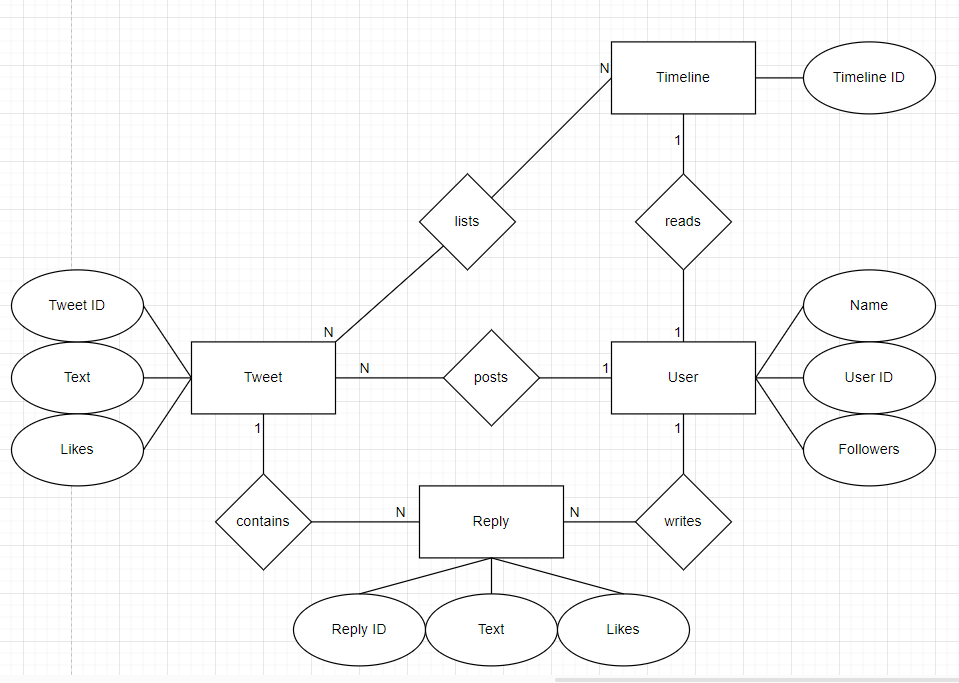

# Y

# MongoDB Report

Datenbanken 2 (262180)

Christian Diegmann | 208822 | 7. Semester

Martin Marsal | 209390 | 7. Semester

Robin Schüle | 208957 | 7. Semester

Repository: https://git.it.hs-heilbronn.de/it/courses/seb/db2/ws23/y

# Einführung

## Why Y?
Y ist eine Social-Media-Plattform ähnlich zu Twitter, die es Nutzern ermöglicht, kurze Textnachrichten, sogenannte "Tweets", zu verfassen und zu veröffentlichen. 
Y dient dazu, Gedanken, Informationen und Meinungen mit einem breiten Publikum zu teilen und kann von Menschen, Organisationen und Prominenten genutzt werden, 
um sich mit anderen auszutauschen, Nachrichten zu verbreiten und Trends zu verfolgen. 
Nutzer können Tweets verfassen und anderen Nutzern folgen, um deren Tweets in ihrem eigenen Feed zu sehen. 
Durch letzteres ist es ihnen ebenfalls möglich die Tweets anderer zu liken und zu kommentieren. 

## ER-Diagramm


## Access Patterns
1.	As a user, I want to post tweets.
2.	As a user, I want to write a reply.
3.	As a premium user, I want to edit tweets.
4.	As a user, I want to read my timeline.
5.	As a user, I want to delete my tweets.
6.	As an admin, I want to delete an inappropriate user.

# Datenmodell

Wir haben uns dazu entschieden, eine einzige User-Collection als Datenmodell zu
benutzen, um alles aggregiert abspeichern zu können.

Die Relationen zu den Tweet- und Timeline-Entitäten werden in Form von Arrays innerhalb
eines User-Entries realisiert. Die Reply-Entität wird ebenfalls als Array innerhalb
der Tweet-Arrays abgespeichert.

Die Attribute der Entitäten werden in Form von JSON beim Erstellen eines Dokuments
abgespeichert.

# Tooling

Wir haben uns dieses Mal dazu entschieden, Jupyter Notebook zu benutzen, um die
Gelegenheit zu nutzen, auch andere Technologien kennenzulernen.
Die Docker-Compose-File startet einen MongoDB-Container für die Datenbank und einen
Jupyter-Container, um den programmatischen Zugriff darauf zu ermöglichen. Innerhalb
des Jupyter-Containers werden die in der requirements.txt vorgegebenen Tools
installiert.

Die Anwendung kann folgendermaßen gestartet werden:

```
cd mongodb
docker compose up
```

Den Großteil der Implementierung haben wir in die my_functions.py-file
ausgelagert, um dann vom Notebook aus darauf zuzugreifen.
Innerhalb des JupyterLabs wird pymongo als Driver benutzt, sowie die
Module bson und unittest.

# Lessons Learned

Nach unserem etwas holprigen Start mit Redis, haben wir versucht mit MongoDB unsere
Daten diesmal so aggregiert wie möglich zu modellieren und waren überrascht, dass man
alles in einer Kollektion abspeichern kann, was sehr ungewohnt im Vergleich zu
relationalen Datenbanken ist.

In unserer Gruppe gibt es schon Leute, die mit MongoDB gearbeitet haben und demnach
waren schon die meisten der Operationen, die man mit dieser Datenbank ausführen kann,
bekannt und es war ziemlich leicht hineinzukommen.
Kompliziert war es ab und zu festzustellen, was man genau für eine Kondition und
Operation angeben musste, um wirklich die gewünschte Aktion auszuführen.

Generell fanden wir es sehr angenehm mit MongoDB zu arbeiten und würden diese auch in
zukünftigen Projekten verwenden, sofern es sich anbieten würde.

## Video


