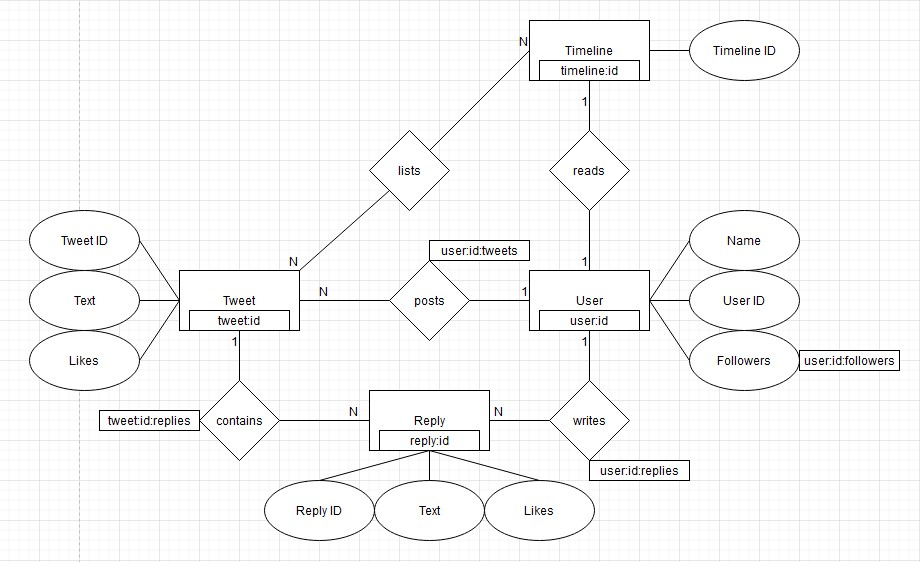
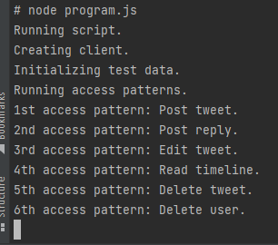
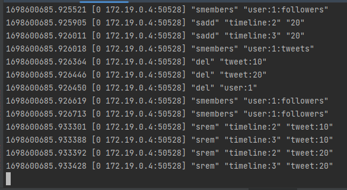

# Y

# Redis Report

Datenbanken 2 (262180)

Christian Diegmann | 208822 | 7. Semester

Martin Marsal | 209390 | 7. Semester

Robin Schüle | 208957 | 7. Semester

Repository: https://git.it.hs-heilbronn.de/it/courses/seb/db2/ws23/y

# Einführung

## Why Y?
Y ist eine Social-Media-Plattform ähnlich zu Twitter, die es Nutzern ermöglicht, kurze Textnachrichten, sogenannte "Tweets", zu verfassen und zu veröffentlichen. 
Y dient dazu, Gedanken, Informationen und Meinungen mit einem breiten Publikum zu teilen und kann von Menschen, Organisationen und Prominenten genutzt werden, 
um sich mit anderen auszutauschen, Nachrichten zu verbreiten und Trends zu verfolgen. 
Nutzer können Tweets verfassen und anderen Nutzern folgen, um deren Tweets in ihrem eigenen Feed zu sehen. 
Durch letzteres ist es ihnen ebenfalls möglich die Tweets anderer zu liken und zu kommentieren. 

## ER-Diagramm


## Access Pattern
1.	As a user, I want to post tweets.
2.	As a user, I want to write a reply.
3.	As a premium user, I want to edit tweets.
4.	As a user, I want to read my timeline.
5.	As a user, I want to delete my tweets.
6.	As an admin, I want to delete an inappropriate user.

# Datenmodell

Unser Datenmodell besteht aus 4 Entitäten: User, Tweet, Reply und Timeline. Dabei wird jeweils jeder Eintrag mit einer ID versehen. 
Jeder User besitzt eine eigene Timeline, in der er Tweets von Personen angezeigt bekommt, denen er folgt. Jeder User kann Tweets verfassen, die dann wiederum in der Timeline seiner Follower angezeigt werden. 
Der Tweet wird dabei dem User zugeordnet, von dem er erfasst wurde, um sicherstellen zu können, dass seine Follower diesen Tweet auch angezeigt bekommen. 
Unter jedem Tweet können zusätzlich Replies erstellt werden, die diesem Tweet zugeordnet werden.
Beispielsweise gibt es den User mit der ID „user:1“.
Der Einfachheit halber haben der User und seine Timeline beide die gleiche ID.

Wenn dieser nun einen Tweet veröffentlicht (tweet:1), wird in der Datenbank eine Relation von diesem User zu seinem Tweet angelegt (key: user:1:tweets, value: 1 (die ID des angelegten Tweets)). 
Genauso verhält sich das für jeden Follower von diesem User, die diesen Tweet in ihre Timeline geschrieben bekommen. 
Hierfür wird mit smembers abgefragt, welche Follower user:1 besitzt und anschließend wird der Tweet bei jedem Follower in die Timeline eingetragen. 
Follower z.B. user:2 (key: timeline:user:2, value: 1). Mit den Replies verhält sich das ähnlich zu den Tweets. Replies werden dem Tweet zugeordnet, unter dem sie verfasst wurden und dem User, der sie geschrieben hat.

Die Attribute der Entitäten werden als JSON beim Erstellen des pairs dem value zugeordnet. Dies ist bei jedem Attribut der Fall außer bei den Followern eines Users, diese haben wir
nämlich als eigenen Key (user:id:followers) in einem Set abgespeichert, und bei der Timeline-ID, da diese nicht direkt als JSON gespeichert, sondern im Keynamen "timeline:id" enthalten
ist.

# Tooling

Die Datenbank haben wir mithilfe einer Dockerumgebung aufgesetzt. Die docker-compose-file startet zwei Container, einen für die Redis Datenbank und einen mit node.js, bei beiden wird das
offizielle Image dafür benutzt. Im Node-Container wird mithilfe von npm die ioredis-library, mit welcher wir dann später weiterführende Commands wie sadd und smembers benutzen konnten,
installiert.


Die Dockerumgebung kann folgendermaßen gestartet werden, falls Docker installiert ist:

```
cd redis
docker compose up
```

Wenn man möchte, kann man in einer zweiten Konsole parallel noch auf die redis-cli zugreifen:

```
docker compose exec redis sh
redis-cli monitor
```





Im ersten Screenshot werden im Nodejs-Container die Logs aus dem Skript ausgegeben. Im zweiten Screenshot wird über redis-cli monitor die Logs der Datenbank angezeigt, um dann
festzustellen, ob die Tests erfolgreich waren.

# Lessons Learned

Wir hatten persönlich noch keine Erfahrung mit Redis und Key Value Datenbanken, deshalb war es eine sehr bereichernde Erfahrung sich mal mit so einer beschäftigt zu haben. Auch sind
unsere Docker-Kenntnisse sehr begrenzt, wodurch wir durch dieses Projekt auf jeden Fall Kenntnisse dazugewinnen konnten.

Einfach war der Zugriff und das Anlegen neuer Datensätze durch get und set.
Kompliziert war es sich sinnvolle Relationen zwischen den Entitäten auszudenken, insbesondere wie diese aufeinander zugreifen. Außerdem gab es ein paar Punkte im Laufe unseres Projekts,
wo wir ins Stocken geraten sind. Einmal war es der Datenbankzugriff über unser Skript, bei der ein legacyMode auf true gesetzt wurde, obwohl dies nicht nötig war und das andere Mal war,
als wir die normale redis-library von npm benutzen wollten, die aber keine weiterführenden Commands wie sadd und smembers unterstützt, wodurch wir auf die ioredis-library umsteigen
mussten. Ansonsten gab es mehrmals in unserer Kommunikation die Verwechselung zwischen dem normalen set-Command und dem Datentypen Set, wodurch wir uns auch irgendwann auf Konventionen
einigen mussten. Wir sind noch nicht völlig dahintergestiegen, wie man eine Dockerumgebung am effizientesten zum Entwickeln benutzen kann und hoffen, uns dieses Wissen noch in den nächsten beiden
Projekten aneignen zu können.

Überraschend fanden wir, was man doch so alles mit einer simplen key-value-Datenbank erreichen kann.

## Video


