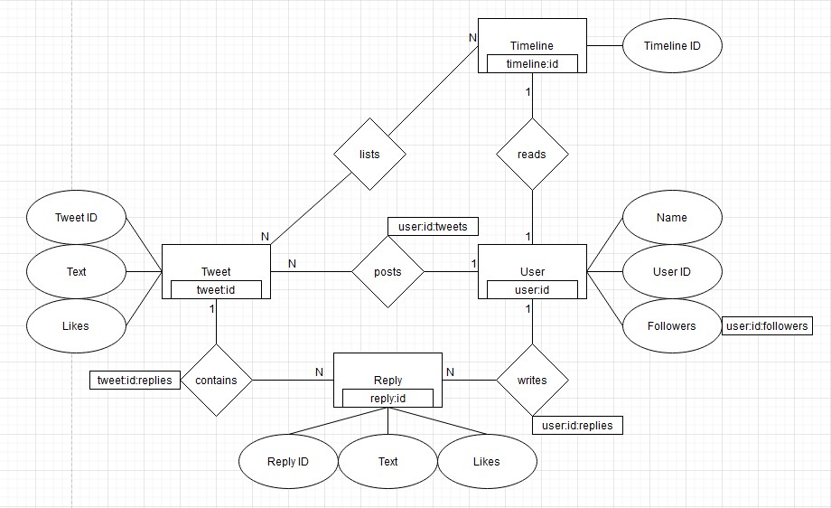

# Y

# Redis Report

Datenbanken 2 (262180)

Christian Diegmann | 208822 | 7. Semester

Martin Marsal | 209390 | 7. Semester

Robin Schüle | 208957 | 7. Semester

Repository: https://git.it.hs-heilbronn.de/it/courses/seb/db2/ws23/y

# Einführung

## Why Y?
Y ist eine Social-Media-Plattform ähnlich zu Twitter, die es Nutzern ermöglicht, kurze Textnachrichten, sogenannte "Tweets," zu verfassen und zu veröffentlichen. 
Y dient dazu, Gedanken, Informationen und Meinungen mit einem breiten Publikum zu teilen und kann von Menschen, Organisationen und Prominenten genutzt werden, 
um sich mit anderen auszutauschen, Nachrichten zu verbreiten und Trends zu verfolgen. 
Nutzer können Tweets verfassen und anderen Nutzern folgen, um deren Tweets in ihrem eigenen Feed zu sehen. 
Durch letzteres ist es ihnen ebenfalls möglich die Tweets anderer zu liken und zu kommentieren. 

## ER-Diagramm

## Access Pattern
1.	As a user, I want to post tweets.
2.	As a user, I want to write a reply.
3.	As a premium user, I want to edit tweets.
4.	As a user, I want to read my timeline.
5.	As a user, I want to delete my tweets.
6.	As an admin, I want to delete an inappropriate user.

# Datenmodell

Unser Datenmodell besteht aus 4 Entitäten: User, Tweet, Reply und Timeline. Dabei wird jeweils jeder Eintrag mit einer ID versehen. 
Jeder User besitzt eine eigene Timeline in der er Tweets von Personen angezeigt bekommt, denen er folgt. Jeder User kann Tweets verfassen, die dann wiederum in der Timeline seiner Follower angezeigt werden. 
Der Tweet wird dabei dem User zugeordnet von dem er erfasst wurde, um sicherstellen zu können, dass seine Follower diesen Tweet auch angezeigt bekommen. 
Unter jedem Tweet können zusätzlich Replies erstellt werden, die diesem Tweet zugeordnet werden.
Beispielsweise gibt es den User mit der ID „user:1“.  
Wenn dieser nun einen Tweet veröffentlicht (tweet:1), wird in der Datenbank eine Relation von diesem User zu seinem Tweet angelegt (key: user:1:tweets, value: 1 (die ID des angelegten Tweets)). 
Genauso verhält sich das für jeden Followern von diesem User, die diesen Tweet in ihre Timeline geschrieben bekommen. 
Hierfür wird mit smembers abgefragt, welche Follower user:1 besitzt und anschließend wird der Tweet bei jedem Follower in die Timeline eingetragen. 
Follower z.B. user:2 (key: timeline:user:2, value: 1).Mit den Replies verhält sich das ähnlich zu den Tweets. Replies werden dem Tweet zugeordnet, unter dem sie verfasst wurden und dem User, der sie geschrieben hat. 
Die Attribute der Entitäten werden als JSON beim Erstellen des pairs dem value zugeordnet.

# Tooling

Ioredis mit set, get, sadd, smembers

# Lessons Learned

Umgang mit Redis und key value Datenbanken und Docker
Einfach war der Zugriff und das Anlegen neuer Datensätze durch get und set. Kompliziert war es sich sinnvolle Relationen zwischen den Entitäten auszudenken, insbesondere wie diese aufeinander zugreifen.

## Video

